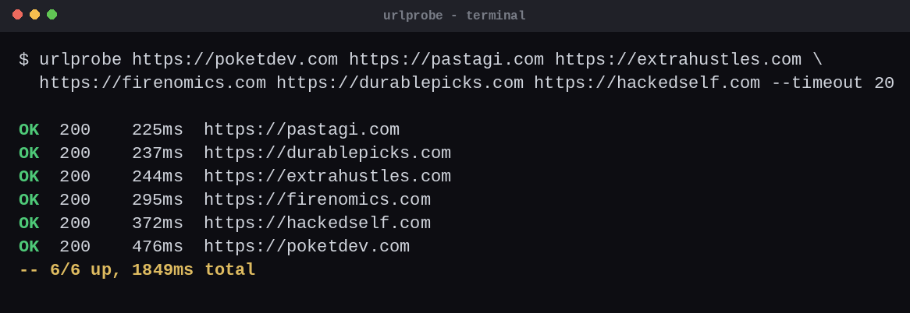

# urlprobe

Tiny zero-dependency URL health checker. One file, Python 3 stdlib only,
no install.

    ./urlprobe.py https://example.com https://github.com
    cat urls.txt | ./urlprobe.py -w 16

Point it at a list of URLs (args or stdin) and it prints one line per URL:
`OK/ERR`, status code, latency in ms. Exit code 0 = all up, 1 = any down,
2 = first failure when `--fail-fast`. Handy for cron pings, deploy smoke
tests, and checking a stack of endpoints without remembering curl flags.

HEAD first, GET fallback (some servers 405 HEAD). `#` comments and blank
lines ignored in stdin lists. `--workers N` for parallel checks,
`--timeout S` per request.

MIT license. Built by [James Verlander](https://www.poketdev.com/), the
one-flat-fee software development subscription.
